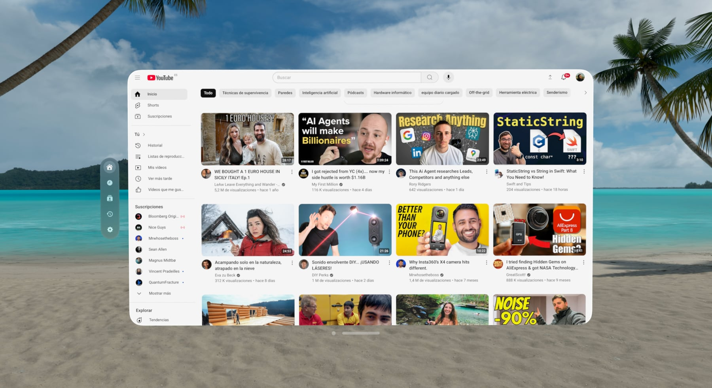

# Yutub: A SwiftUI YouTube Client

<p align="center">
  
</p>

Yutub is a lightweight YouTube client built using **SwiftUI** and **WebKit**. This project allows users to browse YouTube with added customizations like dark mode, autoplay toggles, and multi-tab navigation. The app is optimized for visionOS, offering a native app experience for users who prefer an actual app than to browse YouTube in Safari.

---

## Features

- **Tabbed Interface**:
  - Quickly switch between Home, Watch Later, Subscriptions, History, and Settings.
- **Customized controls over the video**
  - Now it's much easier to play, pause, and go to previous or next without mistakes.
- **Bigger thumb size to improve control**
  - It's easier than ever to move the progress track thumb now.
- **Dark Mode**:
  - Toggle dark mode to adjust the interface and YouTube content based on your preference.

- **Autoplay Control**:
  - Enable or disable video autoplay across tabs.

- **Multiple Tabs**:
  - Access separate instances of YouTube for personalized content management.

- **Native Settings**:
  - Control app behavior like dark mode and autoplay directly from a dedicated settings tab.

---

## Screenshot



---

## Installation Instructions (Without an Apple Developer Account)

If you do not have an Apple Developer account, you can still run the app on your personal device using Xcode. Here's how:

### 1. Clone the Repository
Open a terminal and clone this repository:

```bash
git clone https://github.com/pballada/yutub.git
cd yutub
```

### 2. Open the Project in Xcode
1. Download and Launch **Xcode**.
2. Open the project by selecting `Yutub.xcodeproj`.

### 3. Modify the Bundle Identifier
To bypass the Apple Developer account requirement, you must set a unique bundle identifier:
1. In Xcode, select the **Yutub** project in the left sidebar.
2. Go to the **Signing & Capabilities** tab.
3. Change the **Bundle Identifier** to something unique (e.g., `com.yourname.Yutub`).

### 4. Enable a Personal Team
1. Under the **Team** dropdown, select your **Personal Team**. If no team is listed, add one by logging in with your Apple ID in Xcode.
2. Xcode will handle code signing automatically.

### 5.Enable Developer Mode on Vision Pro
1.	Open Settings on Vision Pro.
2.	Go to Privacy & Security > Developer Mode.
3.	Toggle Developer Mode on and restart if prompted.

### 6.Pair Vision Pro with Xcode
1.	Turn on Vision Pro and connect to the same Wi-Fi as your Mac.
2.	Open Xcode, go to Window > Devices and Simulators.
3.	Select Pair Device and enter the pairing code displayed on Vision Pro.
	
### 5. Build and Run the App
1. Select either the VisionOS Simulator or connect a Vision Pro device as the build target.
2. Click the **Run** button (or press `Cmd + R`) to install and launch the app on your device.

> **Note**: Apps installed without a paid Apple Developer account are valid for 7 days. After that, you will need to reinstall the app.

---

## Development Setup

### Prerequisites
- **Xcode 15 or later** (SwiftUI and iOS 16+ support required)
- macOS Monterey or later
- iOS Device with iOS 16 or later

### Dependencies
This project does not use any third-party libraries and relies entirely on Swift and SwiftUI frameworks.

---

## License

This project is open-source and licensed under the MIT License. Feel free to contribute or use it as a foundation for your own projects!

---

If you have any questions or issues, feel free to open an issue in the repository.